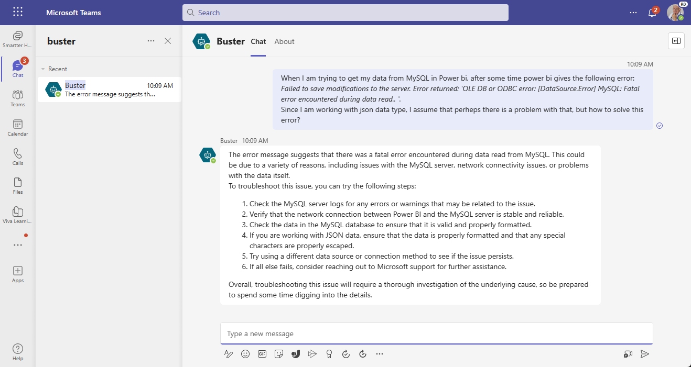
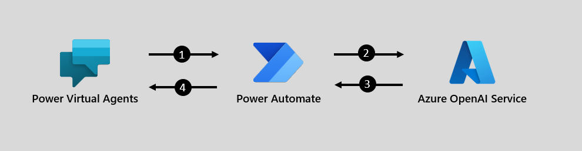

# power-platform-chatGPT
 Samples for using ChatGPT with the Power Platform

## PVA to OpenAI

This sample seeks to provide an easy way to try out:

- Using Power Virtual Agents for the rapid development of the bot, deployment to channels like Teams chat, and basic conversational flow
- The bot calling the Azure OpenAI service for ChatGPT capabilities (e.g. GPT 3.5 completions model) to answer questions
- Include prompt engineering to limit question scope and ensure the completions are used in line with Responsible AI principles

The use case for this sample was inspired by this Microsoft Healthcare and Life Sciences blog [Azure OpenAI ChatGPT Solves Cryptic Error Codes from Power BI, SQL Server, Power Apps, and more! - Microsoft Community Hub](https://techcommunity.microsoft.com/t5/healthcare-and-life-sciences/azure-openai-chatgpt-solves-cryptic-error-codes-from-power-bi/ba-p/3803661).

### Architecture

1. User message passed to Power Automate for pre-processing and prompt engineering
2. HTTPS call to Azure OpenAI completions model with valid body
3. Response parsed by Power Automate
4. Message history provided to Power Virtual Agents. Response is displayed in the chat.

### Deploying the sample

Prerequisites:

- Provision Azure OpenAI service with API Key
  - Deploy the *gpt-35-turbo* model
- Gain Environment Maker access to a Power Platform environment
  - Ensure HTTPS connector is not blocked by DLP rules

Steps:

1. Download the latest PvaToOpenAisolution file from the [Solution File History](/solution-file-history/) folder (or build the solution from the [source](/src/PVAtoOpenAI/) folder)
2. Deploy the solution to a Development environment
3. Publish the solution
4. In the *Help from ChatGPT with Chat History* cloud flow, edit the following placeholder values with your specific values through the **Azure OpenAI Studio**:
   1. ENDPOINT - update to use the endpoint for your Azure OpenAI service
   2. DEPLOYMENT - update to use the name of the deployment of your *gpt-35-turbo* model
   3. APIKEY - update to use one of the keys for the Azure OpenAI service
5. Publish the *Sample-Buster* bot
6. Deploy the bot to a channel (e.g. Teams channel)

### Notes and considerations

- This sample is provided as a learning tool to easily try out the capability, not presented as a final solution
- The ChatGPT model is leveraged in the Power Virtual Agent as a *fallback* for when a structured Topic or Conversation Booster does not exist.
- As this is non-production sample, the API key is stored directly in the flow definition, KeyVault is a more secure approach.
- This is structured to use Azure OpenAI, keeping control over the data passed to the service and ensuring the contents are not used to train vendors' models. Consider storing your own history in Azure for your own future training and refinement.
- There is some basic message pre-processing to strip out certain characters that a user can type in. Consider adding additional steps to this preprocessing.
- There is basic message history that is included so ChatGPT can have context. Consider limiting the amount of history to ensure information is not lost in the prompt to the completion model.
